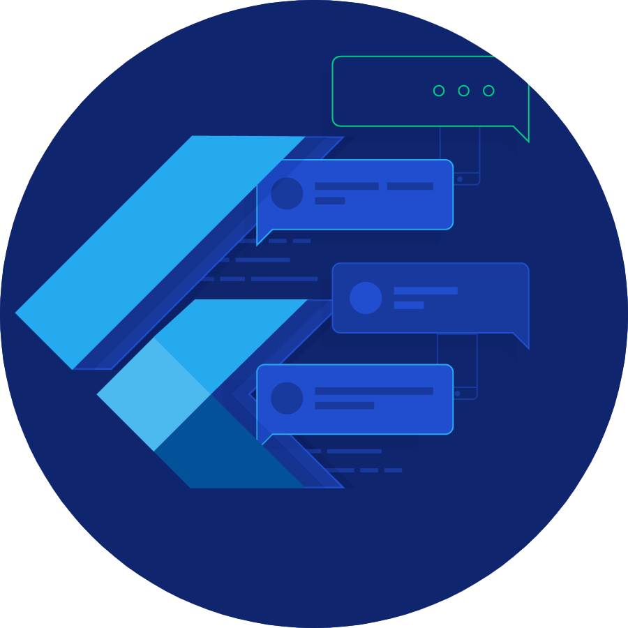

[](https://github.com/TayyabAsghar/MAD-Sem6/network)
[](https://github.com/TayyabAsghar/MAD-Sem6/stargazers)


<a href= "https://github.com/TayyabAsghar/MAD-Sem6/blob/master/assets/icons/android.png">

</a>

# 🔍 Overview

MAD-Sem6 is a Mobile Development Course Project that contains `Basic` ➡️ `Medium` implementation of different widgets. As a whole it doesn't make any sense as it is made according to given assignments to learn different widgets. Each screen is different from other.

# 📱 Screens Widgets Used

These are some screens and features that has been implemented.

## 1️⃣ Screen

|                |                |
| -------------- | -------------- |
| ![][screen1.1] | ![][screen1.2] |

## 2️⃣ Screen

<!-- Do not merge the tables as it will make the 4th cell empty on Github. -->

|                |                |
| -------------- | -------------- |
| ![][screen2.1] | ![][screen2.2] |

|                |
| -------------- |
| ![][screen2.3] |

## 3️⃣ Screen

|                |                |
| -------------- | -------------- |
| ![][screen3.1] | ![][screen3.2] |

|                |
| -------------- |
| ![][screen3.3] |

## 4️⃣ Screen

|                |                |
| -------------- | -------------- |
| ![][screen4.1] | ![][screen4.2] |
| ![][screen4.3] | ![][screen4.4] |

## 5️⃣ Screen

|              |
| ------------ |
| ![][screen5] |

## 6️⃣ Screen

|              |
| ------------ |
| ![][screen6] |

## 7️⃣ Screen

|              |
| ------------ |
| ![][screen7] |

# 👽 External API

<a href="https://source.unsplash.com">
</a>

# 📚 Flutter Resource

A few resources to get you started if this is your first Flutter project:

- [Lab: Write your first Flutter app](https://flutter.dev/docs/get-started/codelab)
- [Cookbook: Useful Flutter samples](https://flutter.dev/docs/cookbook)

For help getting started with Flutter, view our [online documentation](https://flutter.dev/docs), which offers tutorials, samples, guidance on mobile development, and a full API reference.

# ↓ Installation for 🐱‍💻 Development

System prerequisites

- [Flutter SDK][fsdk]
- [Android Studio][astudio]

Clone and change into the project

```sh
$ git clone https://github.com/TayyabAsghar/MAD-Sem6.git
$ cd mobile_app_dev_sem_6
```

Install packages

```sh
$ flutter pub get
```

Start developing!

[fsdk]: https://flutter.dev/docs/get-started/install
[astudio]: https://developer.android.com/studio

<!-- Screens -->

[screen1.1]: assets/screenShots/Screen1.1.jpg
[screen1.2]: assets/screenShots/Screen1.2.jpg
[screen2.1]: assets/screenShots/Screen2.1.jpg
[screen2.2]: assets/screenShots/Screen2.2.jpg
[screen2.3]: assets/screenShots/Screen2.3.jpg
[screen3.1]: assets/screenShots/Screen3.1.jpg
[screen3.2]: assets/screenShots/Screen3.2.jpg
[screen3.3]: assets/screenShots/Screen3.3.jpg
[screen4.1]: assets/screenShots/Screen4.1.jpg
[screen4.2]: assets/screenShots/Screen4.2.jpg
[screen4.3]: assets/screenShots/Screen4.3.jpg
[screen4.4]: assets/screenShots/Screen4.4.jpg
[screen5]: assets/screenShots/Screen5.jpg
[screen6]: assets/screenShots/Screen6.jpg
[screen7]: assets/screenShots/Screen7.jpg
